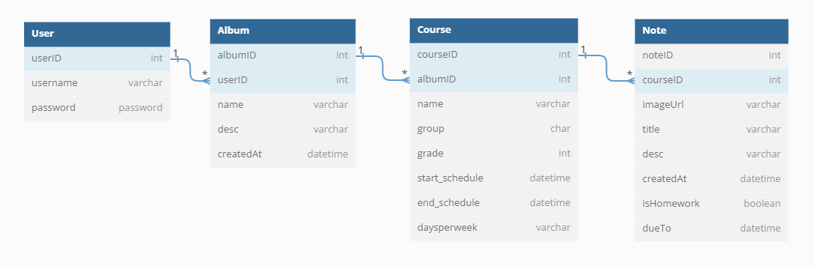
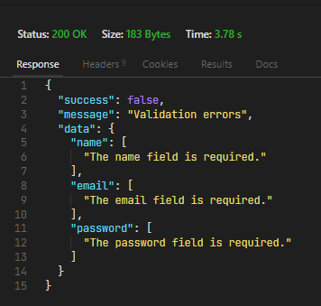

# **PicNote API**

La documentación busca registrar todos los aspectos importantes desde la configuración hasta la finalización de ésta API hecha con el framework laravel (PHP).

[**Consultar código primordial para esta API>>>**](doc/markdown/README.md)

La funcionalidad esperada queda descrita a continuación:

Se dan de alta apuntes tomados como fotografías o notas, estos apuntes pertenecen a materias de las cuales se toman clases. El objetivo es conseguir una manipulación tipo álbum, con mayor organización de apuntes según las respectivas materias a las que pertenecen.

Se busca que la funcionalidad de esta API sea dinámica. Segun las materias dadas de alta por el usuario y su respectivo horario, la alta de apuntes debe asignarse de forma organizada y de forma automática hacia la materia o álbum correspondiente. 

---
<br>

## **CREACION DEL PROYECTO:**

```composer create-project laravel/laravel PicNote-API```

<br>

## **DISEÑO TABLAS**

Diseño prototipo para generar un diagrama en [**dbDiagram.io**](https://dbdiagram.io/):

```SQL
Table User {
  userID int
  username varchar 
  password password
}

Table Album{
  albumID int
  userID int [ref: > User.userID] 
  name varchar
  desc varchar
  createdAt datetime
}

Table Course{
  courseID int
  albumID int [ref: > Album.albumID]
  name varchar
  group char
  grade int
  start_schedule datetime
  end_schedule datetime
  daysperweek varchar
}

Table Note {
  noteID int
  courseID int [ref: > Course.courseID]
  imageUrl varchar
  title varchar
  desc varchar
  createdAt datetime
  isHomework boolean
  dueTo datetime
}
```


---

<br>

## **CREACION DE MODELOS**

- -c controller
- -m migration file
- -f factory (seeding)
- --api  

**Desde una terminal**

```php artisan make:model Album -c -m -f --api```

```php artisan make:model Course -c -m -f --api```

```php artisan make:model Note -c -m -f --api```

> **NOTA:** El modelo User viene creado por defecto en cada proyecto laravel

---

<br>

## **SCHEMAS**

```php
Schema::create('albums', function (Blueprint $table) {
    $table->id();
    $table->foreignId('user_id')->constrained();
    $table->string('name', 25);
    $table->string('description');
    $table->timestamps();
});
```

```php
Schema::create('courses', function (Blueprint $table) {
    $table->id();
    $table->foreignId('album_id')->constrained();
    $table->string('name',100);
    $table->char('group',4);
    $table->tinyInteger('grade');
    $table->dateTime('start_schedule');
    $table->dateTime('end_schedule');
    $table->string('daysperweek',100);
    $table->timestamps();
});
```

```php
Schema::create('notes', function (Blueprint $table) {
    $table->id();
    $table->foreignId('course_id')->constrained();
    $table->string('image_url');
    $table->string('title',100);
    $table->string('description');
    $table->boolean('isHomework');
    $table->dateTime('dueTo');
    $table->timestamps();
});
```
<br>

## **RELACIONES**

> Desde cada modelo creado se deben establacer las relaciones que se tienen con otras entidades.

```php
User
public function albums(){
    // Un usuario tiene varios albumes
    return $this->hasMany(Album::class);
}


Album
public function user(){
    return $this->belongsTo(User::class);
}

public function courses(){
    return $this->hasMany(Course::class);
}


Course
public function album(){
    return $this->belongsTo(Album::class);
}

public function notes(){
    return $this->hasMany(Note::class);
}


Note
public function course(){
    return $this->belongsTo(Course::class);
}
```

---

## **RUTAS**

> Rutas para el consumo de las funcionalidades de la API

- /
  
- user/create
- user/{user}
- user/{user}/albums

- album/create
- album/{album}
- album/{album}/courses

- course/create
- course/{course}
- course/{course}/notes

- note/create
- note/{note}

---

<br>

## **Validaciones a los Requests**

```php artisan make:request UserRequest```

> Lo anterior crea archivo en app/http/requests

Dentro del archivo UserRequest.php se deben agregar las importaciones:

```php
namespace App\Http\Requests;
use Illuminate\Foundation\Http\FormRequest;
use Illuminate\Http\Exceptions\HttpResponseException;
use Illuminate\Contracts\Validation\Validator;
```

Se debe agregar los siguientes métodos:

```php
 public function rules()
  {
      return [
          'name' => 'required',
          'email' => 'required|email|unique:users',
          'password' => 'required|min:6'
      ];
  }

  //El formato json que retorna
  public function failedValidation(Validator $validator)
  {
      throw new HttpResponseException(response()->json([
          'success'   => false,
          'message'   => 'Validation errors',
          'data'      => $validator->errors()
      ]));
  }

  /*
  Si se quiere sobreescribir los mensajes de error por defecto de laravel
  public function messages()
  {
      return [
          'email.required' => 'Email is required',
          'email.email' => 'Email is not correct'
      ];
  }
  */
```

> Por defecto laravel tiene retorno de mensajes para las reglas que se indiquen (required,min:5,etc)


Por último se sustituye en el método donde se desee aplicar las reglas:

**UserController.php**

```php
use App\Http\Requests\UserRequest;

...

public function store(UserRequest $request)
{   

}
```

> Aunque no tenga contenido el método store se está evaluando por que se espera que el request sea de tipo UserRequest

